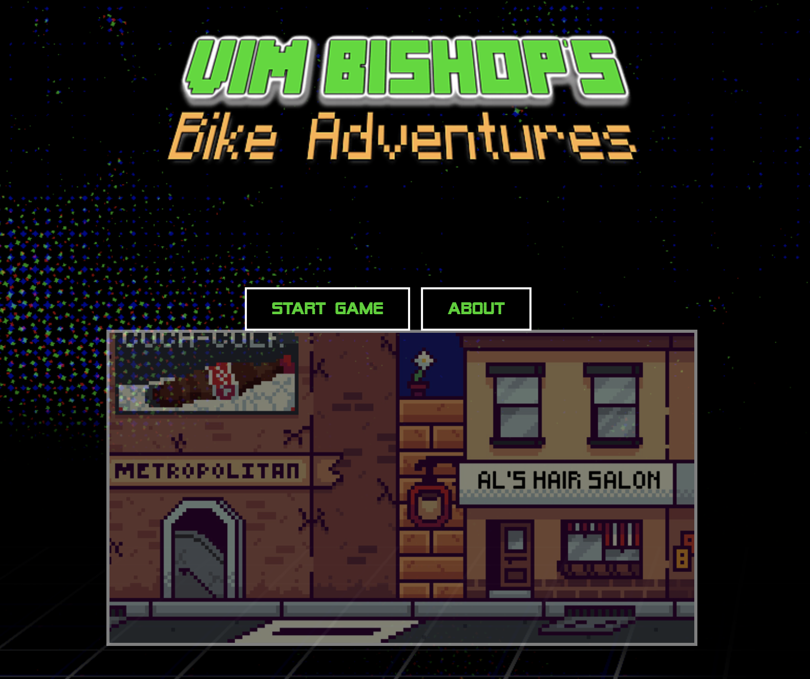
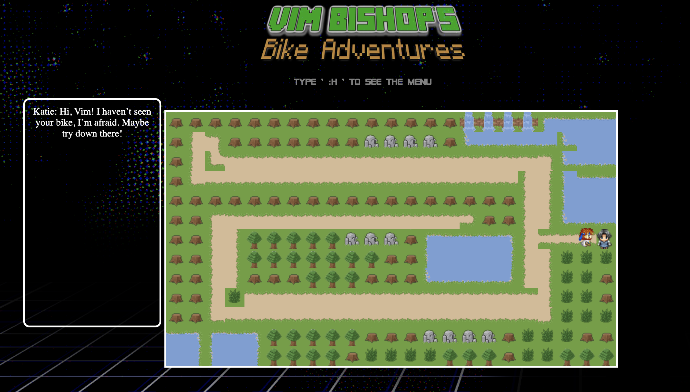
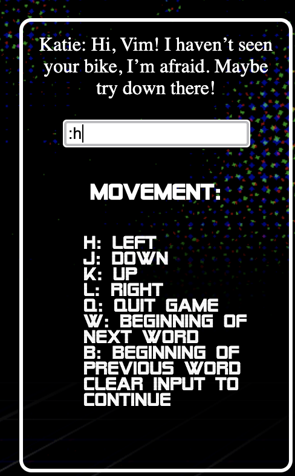

# Vimvincible
 <a href="https://vimvincible.netlify.app/" target="_blank">Deployed here.</a>


### Jump to:

* [What is Vimvincible?](https://github.com/raerachael/invimcible_front_end#what-is-vimvincible)
* [Technologies Used](https://github.com/raerachael/invimcible_front_end#technologies-used)
* [Team Values](https://github.com/raerachael/invimcible_front_end#team-values)
* [Sneak Peak](https://github.com/raerachael/invimcible_front_end#preview)
* [Try it at home!](https://github.com/raerachael/invimcible_front_end#how-to-run-locally)

Welcome to our final team at Makers. At the current stage of development, 8 working days were spent planning, developing, and implementing before a feature freeze, with two further working days dedicated to tidying up code. For a detailed account of the agile working environment and the sprints involved in this project, please visit [the team wiki](https://github.com/RaeRachael/invimcible_front_end/wiki), with the additional [back end wiki](https://github.com/tristanlangford/invimcible_back_end/wiki).


## Team
* [Tristan](https://github.com/tristanlangford)
* [Rae](https://github.com/RaeRachael/invimcible_front_end)
* [Nadine](https://github.com/nadinedelia)
* [Sophie](https://github.com/sofyloafy)
* [Katie](https://github.com/Katie-McDonagh)
* [Al](https://github.com/Sumner1185)

## What is Vimvincible?

This is a topdown <b>educational</b> role play game that follows a character, Vim Bishop, as he looks for his bike.
* Vim can be moved around the levels using the vim commands 'hjkl' in place of arrows keys. 
* The second level allows Vim's character to jump over potholes using the vim command 'w' to jump to the right, mimicking the vim command that allows users to jump to the end of a word, and the 'b' command to jump to the left.

We hope that Vimcincible will provide a fun way for users to become more vim proficient.


## Technologies Used
<br>

| Usage                      | Technology         |
| ---------------------------- | :----------------- |
| Front end framework          | React              |
| Language                     | Javascript         |
| CI/CD                        | Travis             |
| Hosting                      | Heroku, Netlify    |
| Styling                      | Sass, CSS          |
| Front end testing frameworks | Jest               |
| Visual display testing       | Snapshot           |
| Code Coverage                | Jest               |

Using a database to store the user's level and position is part of the plan for future developments.

## Team Values
We fostered a learning environment and wanted to ensure that knowledge sharing was at the root of the team. Here are some values and approaches we found effective in ensuring a great working team:
* As a team, we wanted to write <b>scalable, clean code</b>. As a product, we haven't cut corners in the writing of the code, and we have tried to avoid anything hardcoded. That means that implementing the next 10, 20, etc levels would take a fraction of the time.
* Daily stand-ups, in the form of 9am to check in for the day, 12pm to review morning progress and meeting targets, and 5pm retro to review sprint targets and goals. These include emotional check-ins.
* The final retro at 5pm would involve a knowledge-share, as teams would justify work before merging to the master branch.
* Roles were changed every day to avoid an uneven distribution of non-code-related work. These roles were scrum master, leader, helper, scribe, technician, and ideas person.
* We chatted about personal goals before starting, and ensured that the group goals were aligned to peoples' personal goals.
* Pairing began with the same two people for the duration of the sprint, but this resulted in blind spots in the codebase, as certain people ended up working solely in one area. Switching to a daily swap meant that all members of the group have an understanding of <i>the entire codebase</i>.
* <b>Code production hours 9am-5pm </b>to maintain the integrity of the code and to avoid promoting an unhealthy work/ life balance.
* The team wrote a charter on the first day which set out expectations for the group, group values, and personal work styles. We decided on the first day to have fun, which we have done <b>every day</b>.


## Preview
The landing page:



Level 1, showing Vim having an interaction:



The help menu that can be accessed by typing ':h':



<br>
Level 2:


## How to run locally
1. Fork this repo and clone it locally:
```
git clone git@github.com:...
```
2. Follow the below:

```
npm install
npm start
```
3. Go to your local server: 
```
http://localhost:3000/
```

4. To test, run:
```
npm test
```
